# IRS Taxpayer Representation Flowcharts

## Complete Decision Guide for Enrolled Agents

*Based on PassKey EA Review Part 3: Representation - Units 2-8 (May 2025 - February 2026 Testing Cycle)*

---

## Table of Contents

1. [Master Representation Lifecycle](#master-representation-lifecycle)
2. [Who Can Practice Before the IRS](#1-who-can-practice-before-the-irs)
3. [Authorization Form Selection](#2-authorization-form-selection)
4. [Form 2848 Power of Attorney Guide](#3-form-2848-power-of-attorney-guide)
5. [Circular 230 Duties and Obligations](#4-circular-230-duties-and-obligations)
6. [Due Diligence Requirements](#5-due-diligence-requirements)
7. [Preparer Penalty Assessment](#6-preparer-penalty-assessment)
8. [OPR Disciplinary Process](#7-opr-disciplinary-process)
9. [Innocent and Injured Spouse Relief](#8-innocent-and-injured-spouse-relief)
10. [Taxpayer Bill of Rights](#9-taxpayer-bill-of-rights)
11. [Conflict of Interest Resolution](#10-conflict-of-interest-resolution)

---

## Master Representation Lifecycle

This flowchart shows the complete lifecycle of taxpayer representation from engagement through potential disciplinary action.

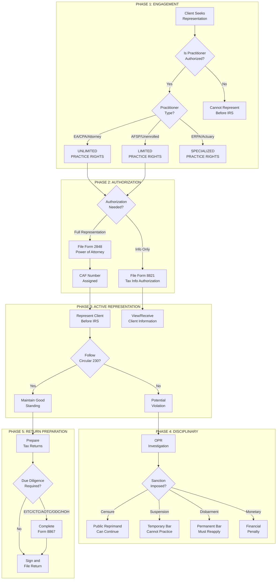

---

## 1. Who Can Practice Before the IRS

### Practitioner Authority Decision Tree

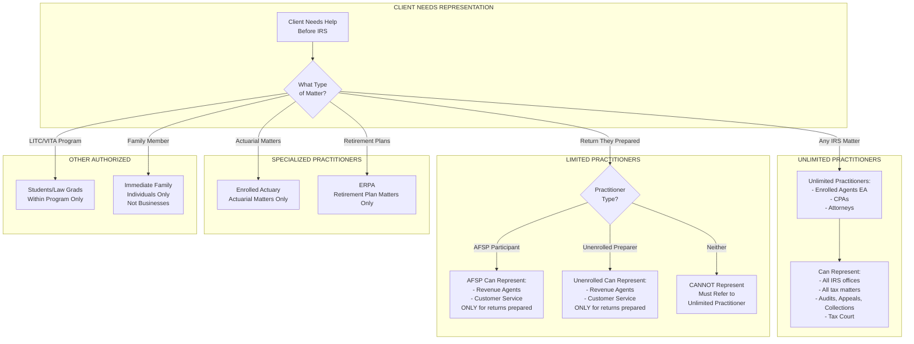

### Practitioner Comparison Table

| Practitioner | Practice Rights | Where Can Represent | Limitations |
|--------------|-----------------|---------------------|-------------|
| **Enrolled Agent (EA)** | Unlimited | All IRS offices | None |
| **CPA** | Unlimited | All IRS offices | None |
| **Attorney** | Unlimited | All IRS offices | None |
| **AFSP Participant** | Limited | Revenue Agents, Customer Service | Returns they prepared only |
| **Unenrolled Preparer** | Very Limited | Revenue Agents, Customer Service | Returns they prepared only |
| **ERPA** | Limited | IRS | Retirement plan matters only |
| **Enrolled Actuary** | Limited | IRS | Actuarial matters only |
| **Student (LITC/VITA)** | Limited | Within program | Program matters only |
| **Family Member** | Limited | IRS | Individual taxpayers only |

---

## 2. Authorization Form Selection

### Form Selection Decision Tree

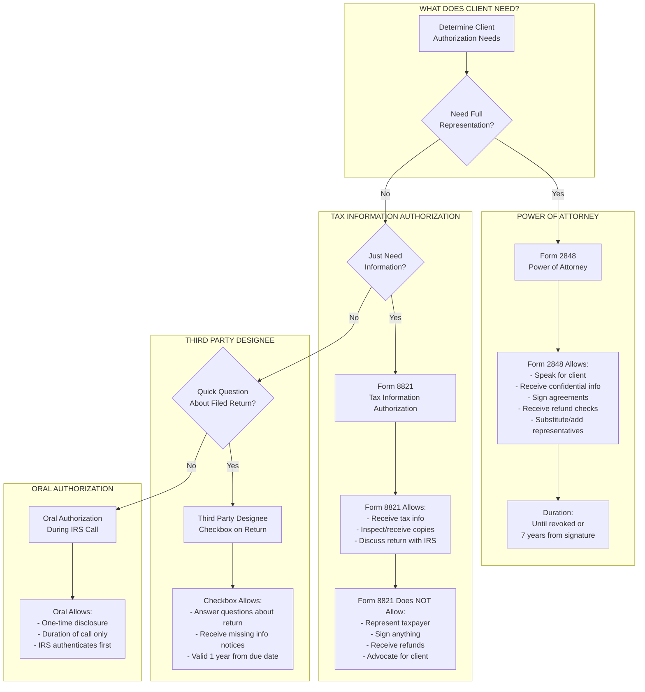

### Authorization Forms Comparison

| Feature | Form 2848 (POA) | Form 8821 (TIA) | Third Party Designee |
|---------|-----------------|-----------------|---------------------|
| **Represent client** | Yes | No | No |
| **Receive info** | Yes | Yes | Limited |
| **Sign documents** | Yes | No | No |
| **Receive refunds** | Yes (if specified) | No | No |
| **Duration** | Until revoked/7 years | Until revoked | 1 year |
| **CAF number** | Yes | Optional | No |
| **Substitute rep** | Yes | No | No |

---

## 3. Form 2848 Power of Attorney Guide

### Form 2848 Completion Flowchart

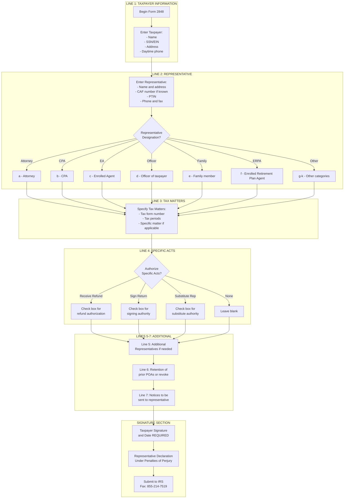

### Acts Authorized vs. Not Authorized by POA

| Authorized (Unless Limited) | NOT Authorized (Must Specify) |
|----------------------------|------------------------------|
| Receive confidential information | Receive refund checks |
| Inspect/receive copies | Sign tax return |
| Perform any acts taxpayer can | Substitute another representative |
| Represent before all IRS offices | Execute waivers |
| Sign agreements (except returns) | Sign closing agreements |
| Execute consents to extend SOL | Execute offers in compromise |

---

## 4. Circular 230 Duties and Obligations

### Complete Circular 230 Duties Map

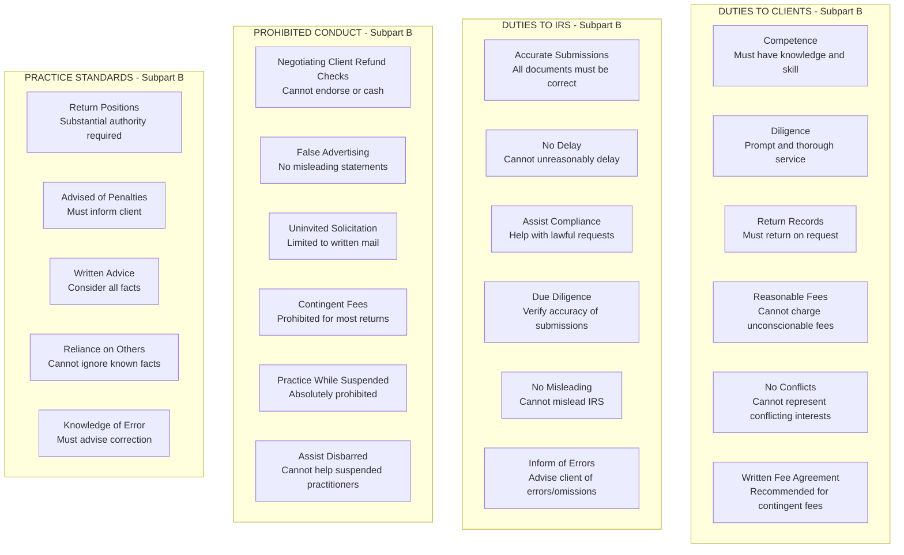

### Circular 230 Violations and Sanctions

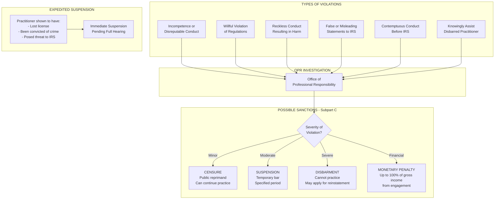

---

## 5. Due Diligence Requirements

### Due Diligence Compliance Flowchart

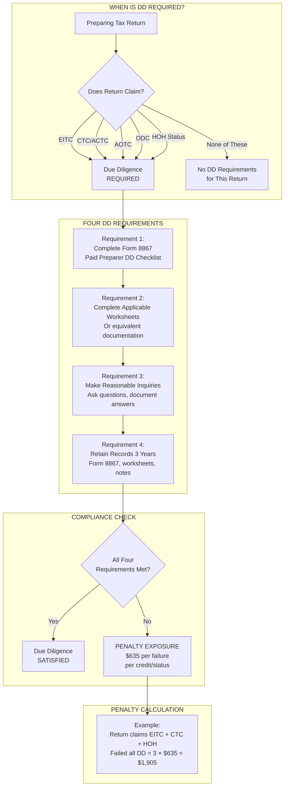

### Form 8867 Requirements by Credit/Status

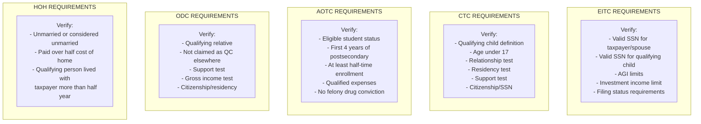

### Due Diligence Penalty Summary

| Credit/Status | Penalty (2024) | What Must Be Verified |
|---------------|----------------|----------------------|
| EITC | $635 | Income, SSN, qualifying children, residency |
| CTC/ACTC | $635 | Qualifying child, age, relationship, SSN |
| AOTC | $635 | Student status, enrollment, expenses |
| ODC | $635 | Qualifying relative, support, income |
| HOH | $635 | Marital status, qualifying person, costs |
| **Multiple on same return** | $635 × each | Each credit/status counted separately |

---

## 6. Preparer Penalty Assessment

### IRC §6694 Penalty Flowchart

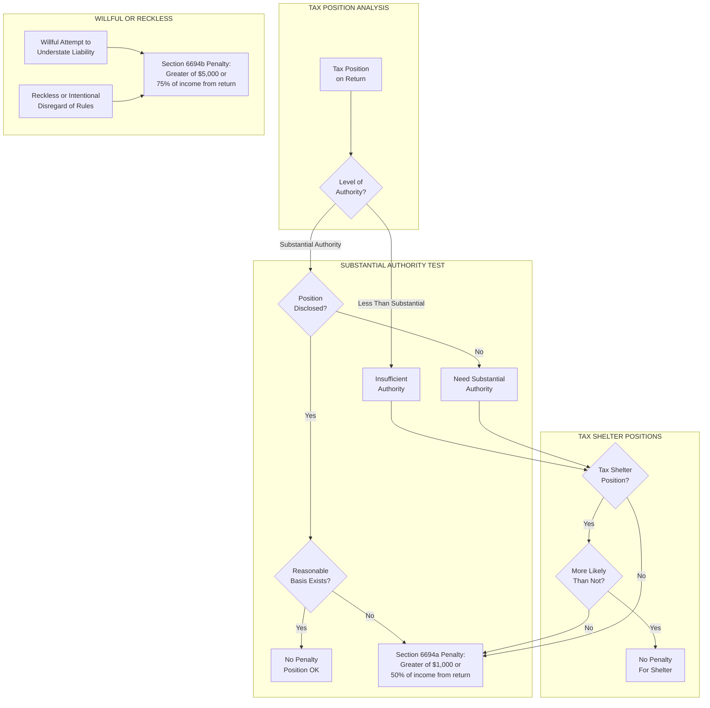

### IRC §6695 Other Preparer Penalties

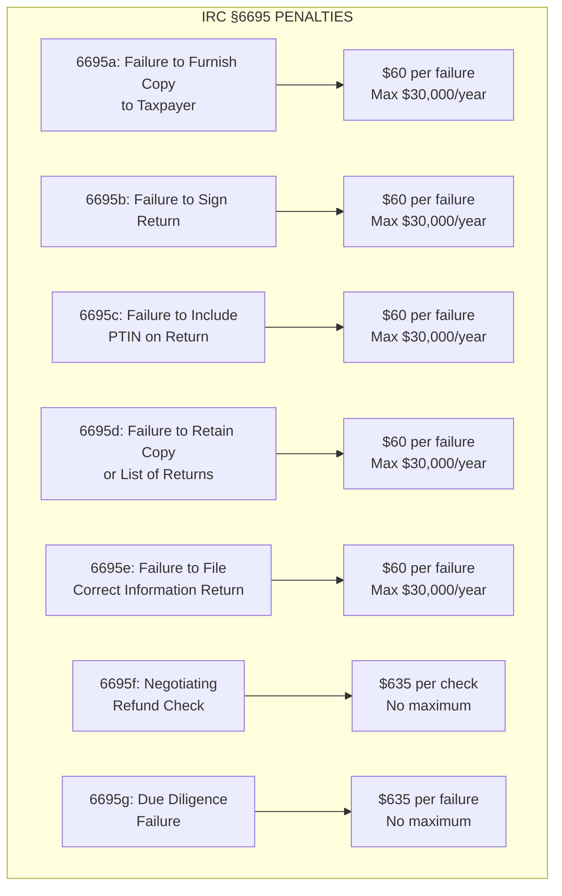

### Penalty Standards Summary

| Penalty | Amount | Trigger | Defense |
|---------|--------|---------|---------|
| §6694(a) Unreasonable Position | Greater of $1,000 or 50% of fee | Position lacks substantial authority | Reasonable cause + good faith |
| §6694(b) Willful/Reckless | Greater of $5,000 or 75% of fee | Willful understatement or reckless disregard | None |
| §6695(a)-(e) Administrative | $60 per failure | Failure to sign, furnish copy, include PTIN, etc. | Reasonable cause |
| §6695(f) Negotiating Check | $635 per check | Endorsing or cashing client refund | None |
| §6695(g) Due Diligence | $635 per credit/status | Failure to meet DD requirements | Reasonable cause |

---

## 7. OPR Disciplinary Process

### Complete OPR Process Flowchart

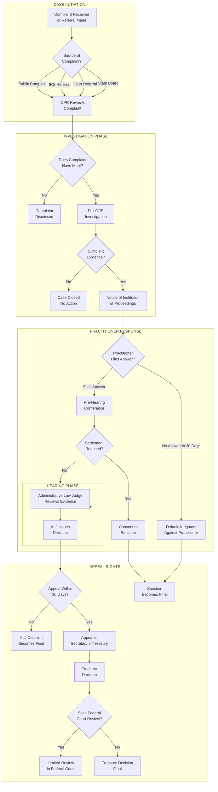

### Expedited Suspension Process

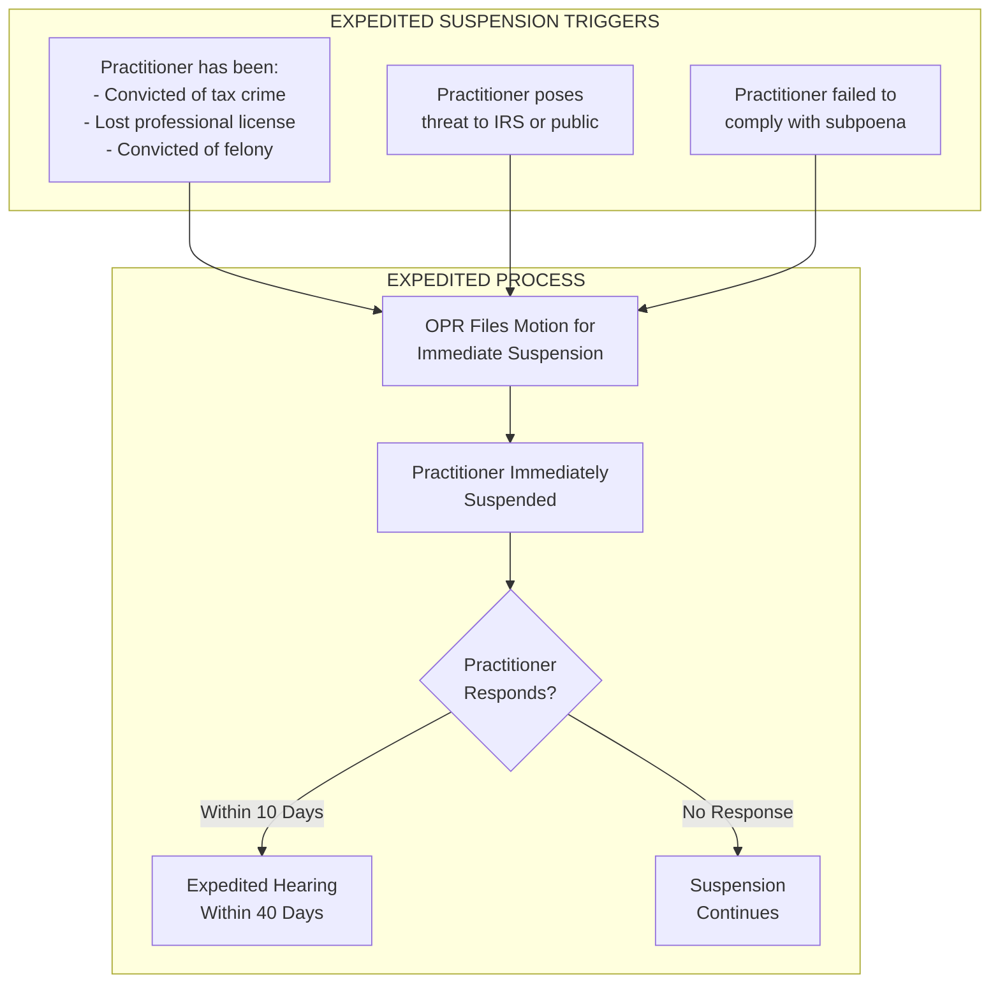

### Sanction Levels

| Sanction | Definition | Effect | Reinstatement |
|----------|------------|--------|---------------|
| **Censure** | Public reprimand | Can continue practice | N/A - no suspension |
| **Suspension** | Temporary prohibition | Cannot practice for specified period | Automatic after period ends |
| **Disbarment** | Indefinite prohibition | Cannot practice | Must petition after 5 years |
| **Monetary** | Financial penalty | Up to 100% of gross income from engagement | N/A |

---

## 8. Innocent and Injured Spouse Relief

### Spouse Relief Decision Tree

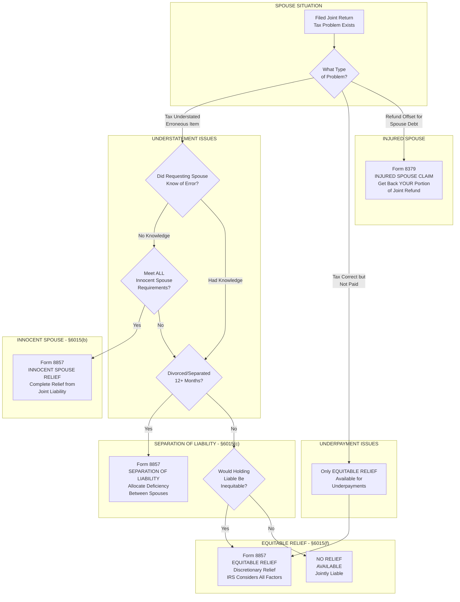

### Three Types of Innocent Spouse Relief Comparison

| Element | Innocent Spouse §6015(b) | Separation of Liability §6015(c) | Equitable Relief §6015(f) |
|---------|--------------------------|----------------------------------|---------------------------|
| **Form** | Form 8857 | Form 8857 | Form 8857 |
| **Problem Type** | Understatement | Understatement | Understatement OR Underpayment |
| **Knowledge** | No knowledge required | Can have knowledge | Considered as factor |
| **Marital Status** | Any | Divorced/separated 12+ months | Any |
| **Effect** | Full relief | Allocates liability | Full or partial relief |
| **Time Limit** | 2 years from collection | 2 years from collection | Varies |

### Injured Spouse vs. Innocent Spouse

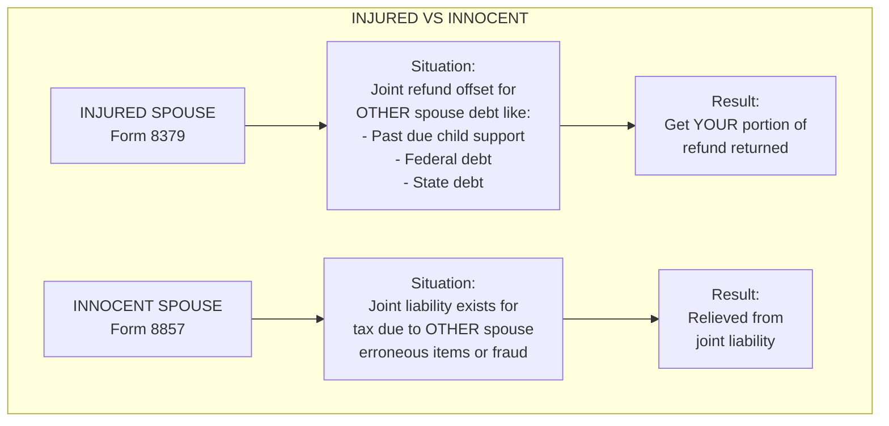

---

## 9. Taxpayer Bill of Rights

### Ten Taxpayer Rights Visualization

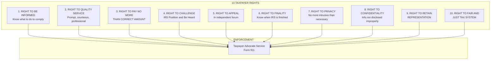

### Taxpayer Advocate Service (TAS)

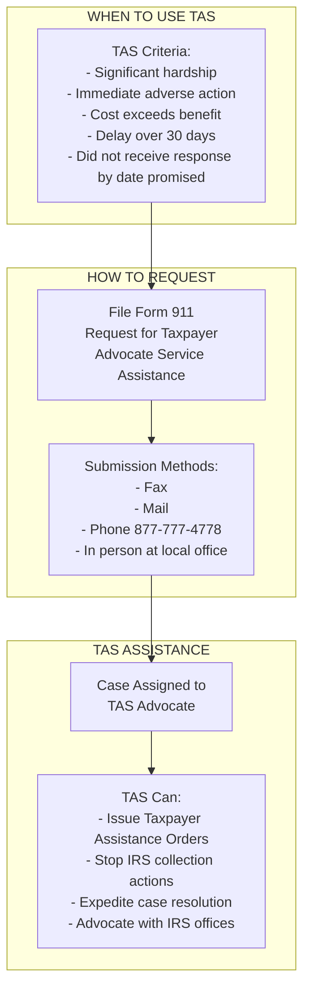

---

## 10. Conflict of Interest Resolution

### Conflict of Interest Decision Tree

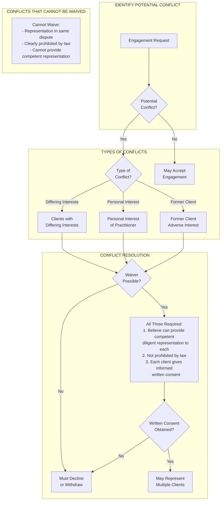

### Conflict Scenarios

| Scenario | Can Represent? | Requirements |
|----------|---------------|--------------|
| Husband and wife (same return) | Yes | Generally no conflict |
| Husband and wife (divorce) | No | Cannot represent both in same proceeding |
| Business partners (same matter) | Maybe | Written consent from both if interests differ |
| Former client vs. current | No | Adverse representation prohibited |
| Practitioner's personal interest | Maybe | Only if no material limitation on representation |

---

## Quick Reference: Key Forms

| Form | Name | Purpose |
|------|------|---------|
| **2848** | Power of Attorney | Full representation authority |
| **8821** | Tax Information Authorization | View information only |
| **8821-A** | Disclosure Authorization | Third-party disclosure for SB/SE |
| **8857** | Request for Innocent Spouse Relief | Innocent/separation/equitable relief |
| **8379** | Injured Spouse Allocation | Recover refund offset |
| **8867** | Paid Preparer's Due Diligence Checklist | DD for EITC/CTC/AOTC/ODC/HOH |
| **911** | Request for Taxpayer Advocate Service | Request TAS assistance |
| **12203** | Request for Appeals Review | Request Appeals conference |

---

*This flowchart guide is based on Circular 230 and IRS procedures current through December 31, 2024, as tested on the EA exam May 2025 - February 2026 cycle.*
